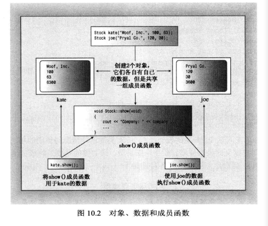

#### 第十章 对象和类

OOP：面向对象编程

最重要的OOP特性：

- 抽象
- 封装和数据隐藏
- 多态
- 继承
- 代码的可重用性

##### 10.2 抽象和类

类规范一般由两个部分组成：

- **类声明**: 以数据成员的方式描述数据部分，以成员函数( 被称为方法)的方式描述公有接口。
- **类方法定义**: 描述如何实现类成员函数。

简单地说，类声明提供了类的蓝图，而方法定义则提供了细节。

**什么是接口**

接口是一个共享框架，供两个系统(如在计算机和打印机之间或者用户或计算机程序之间)交互时使用；

程序接口将您的意图转换为存储在计算机中的具体信息。

对于类，我们说公共接口。在这里，公众(public)是使用类的程序，交互系统由类对象组成，而接口由编写类的人提供的方法组成。

接口让程序员能够编写与类对象交互的代码,从而让程序能够使用类对象。

例如，要计算string对象中包含多少个字符，您无需打开对象，而只需使用string类提供的size()方法。

类设计禁止公共用户直接访问类，但公众可以使用方法size()。方法size( )是用户和string类对象之间的公共接口的组成部分。

通常，方法getline( )是istream 类的公共接口的组成部分，使用cin的程序不是直接与cin
对象内部交互来读取一行输入，而是使用getline( )。

如果希望更人性化，不要将使用类的程序视为公共用户，而将编写程序的人视为公共用户。然而，要使用某个类，必须了解其公共接口；要编写类，必须创建其公共接口。


**类和结构**

类描述看上去很像是包含成员函数以及public和private可见性标签的结构声明。

实际上，C++对结构进行了扩展，使之具有与类相同的特性。它们之间唯一的区别是，结构的默认访问类型是public， 而类为private。

C++程序员通常使用类来实现类描述，而把结构限制为只表示纯粹的数据对象(常被称为普通老式数据(POD, Plain Old Data)结构)。

**10.2.3 实现类成员函数**

还需要创建类描述的第二部分：为那些由类声明中的原型表示的成员函数提供代码。

成员函数定义与常规函数定义非常相似，它们有函数头和函数体，也可以有返回类型和参数。但是它们还有两个特殊的特征:

- 定义成员函数时，使用作用域解析运算符(:)来标识函数所属的类;
- 类方法可以访 问类的private组件。

首先，成员函数的函数头使用作用域运算符解析(::) 来指出函数所属的类。例如，update( )成员函数的函数头如下:

```c++
void Stock::update (double price)
```

这种表示法意味着我们定义的update()函数是Stock类的成员。这不仅将update()标识为成员函数，还意味着我们可以将另一个类的成员函数也命名为update()。例如，Buffoon()类的update()函数的函数头如下:

```c++
void Buffoon::update()
```


所创建的每个新对象都有自己的存储空间，用于存储其内部变量和类成员:但同一个类的所有对象共享同一组类方法，即每种方法只有一一个副本。

例如，假设kate 和joe都是Stock对象，则kate.shares将占据一个内存块，而joe.shares占用另一个内存块，但kate.show( )和joe.show( )都调用同一个方法，也就是说，它们将执行同一个代码块，只是将这些代码用于不同的数据。

在OOP中，调用成员函数被称为发送消息，因此将同样的消息发送给两个不同的对象将调用同一个方法，但该方法被用于两个不同的对象。 



###### 10.2.4 使用类

编写了usestock0.cpp后，使用如下命令将其与stock00.cpp编译，并确保stock00.h位于当前文件夹中：

```shell
g++ usestock0.cpp stock00.cpp	# 联合编译
./a.exe	#执行输出文件
```

###### 小结

假设Bozo类的构造函数的原型如下:

```c++
Bozo (const char * fname， const char * lname) ;// constructor prototype
```

则可以使用它来初始化新对象:

```c++
Bozo bozetta = bozo ("Bozetta", "Biggens"); // primary form
Bozo fufu("Fufu"，"O' Dweeb") ;// short form
Bozo *pc = new Bozo("Popo", "Le Peu") ;// dynamic object
```

如果编译器支持C++11,则可使用列表初始化:

```c++
Bozo bozetta = {"Bozetta", "Biggens"};// C++11 
Bozo fufu{"Fufu"， "O' Dweeb"}// C++11;
Bozo *pc = new Bozo{"Popo", "Le Peu"};// C++11
```


如果构造函数使用了new，则必须提供使用delete的析构函数。