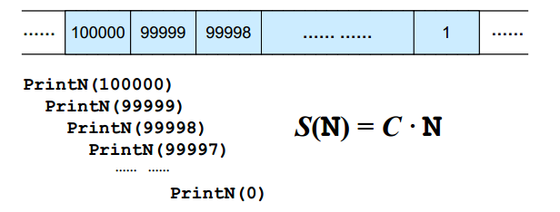
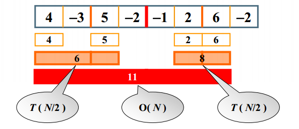
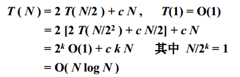

#### 1.2 什么是算法

##### 1.2.1 算法定义（Algorithm）：

1. 一个有限指令集

2. 接受一些输入（有些情况下不需要输出）

3. 产生输出

4. 一定在有限步骤之后终止

5. 每一条指令必须

   有充分明确的目标，不可以有歧义
   计算机能处理的范围之内
   描述应不依赖于任何一种计算机语言以及具体的实现手段

```c++
//选择排序伪代码描述
void SelectionSort(int List[], int N)
{ /**将N个整数List[0]...List[N-1]进行非递减排序
 	for (i=0; i<N; i++){
 		MinPosition = ScanForMin(List, i, N-1);
 		/*List[i]到List[N-1]中找最小元，并将其位置赋给MinPosition*/
 		Swap(List[i], List{MinPosition});
 		/*将未排序部分的最小元换到有序部分的最后位置*/
 	}
}
```


##### 1.2.2 什么是好算法

**空间复杂度S(n)** —— 根据算法写成的程序在执行时占用存储单元的长度。这个长度往往与输入数据的规模有关。空间复杂度过高的算法可能导致使用的内存超限，造成程序非正常中断。

**时间复杂度T(n)** —— 根据算法写成的程序在执行时耗费时间的长度。这个长度往往也与输入数据的规模有关。时间复杂度过高的低效算法可能导致我们在有生之年都等不到运行结果。 

例2：

```c
void PrintN(int N){
	if(N){
		PrintN(N-1);
		printf("%d\n", N);
	}
	return;
}
```

解释：内存是有限的，函数执行时每次都要在内存中保存状态，PrintN(100000)到PrintN(1)中的每一个都要在内存中保存状态，之后才能递归返回，数太大，内存可能就不够系统保存这么多函数的状态了。



例3：

```c
double f(int n, double a[], double x){
	int i;
    double p = a[0];
    for (i=1; i<=n; i++)
        p += (a[i] * pow(x, i)); //(1+2+...+n)=(n^2+n)/2次乘法
    return p;
}

double f(int n, double a[], double x){
	int i;
    double p = a[n];
    for (i=1; i>n; i--)
        p = a[i-1] + x*p; //n次乘法
    return p;
}
```

前提：系统计算加减时间远远小于乘除时间，因此只计算函数的乘除时间


##### 1.2.3 复杂度的表示

**复杂度**：

- 最坏情况复杂度 T_worst( n )
- 平均复杂度 T_avg( n )
- T_avg( n ) <= T_worst( n ) 

**渐进表示法**：

- T(n) = O(f(n)) 表示存在常数C >0, n_0>0 使得当n>=n_0 时有T(n) <= C*f(n) （上界）
- T(n) = Ω(g(n)) 表示存在常数C >0, n_0>0 使得当n>=n_0 时有T(n) >= C*g(n) （下界）
- T(n) = Θ(h(n)) 表示同时有T(n) = O(h(n)) 和T(n) = Ω(h(n)) 

**输入规模**：1 < logn < n < nlogn < n^2 < n^3 <2^n < n! （单指n比较大的情况）

**复杂度分析**：

- 若两段算法分别有复杂度T_1(n) = O(f_1(n)) 和T_2(n) =O(f_2(n))，则
  T_1(n) + T_2(n) = max(O(f_1(n)), O(f_2(n)) )
  T_1(n) x T_2(n) = O( f_1(n) x f_2(n) )
- 若T(n)是关于n的k阶多项式，那么T(n)=Θ(n^k)，即只取最高次方的
- 一个for循环的时间复杂度等于循环次数乘以循环体代码的复杂度
- if-else 结构的复杂度取决于if的条件判断复杂度和两个分枝部分的复杂度，总体复杂度取三者中最大 


#### 1.3 应用实例

##### 1.3.1 最大子列和问题

给定N个整数的序列${A_1, A_2, A_3,...,A_N}$，求函数$f(i, j) = max(0, {A_i,...A_j})$的最大值。 求的是所有连续子列和里最大的那个。

```c

/**
 * O(N^3)
 */
int MaxSubseqSum1(int A[], int N) {
    int ThisSum, MaxSum = 0;
    int i, j, k;
    for (i = 0; i < N; i++) {   /* i是子列左端位置 */
        for (j = i; j < N; j++) {    /* j是子列右端位置 */
            ThisSum = 0;     /* ThisSum是从A[i]到A[j]的子列和 */
            for (k = i; k <= j; k++)
                ThisSum += A[k];     /* 如果刚得到的这个子列和更大,更新结果 */
            if (ThisSum > MaxSum)
                MaxSum = ThisSum;
        }    /* j循环结束 */
    }    /* i循环结束 */
    return MaxSum;
}

/**
 * O(N^2)
 */
int MaxSubseqSum2(int A[], int N) {
    int ThisSum, MaxSum = 0;
    int i, j, k;
    for (i = 0; i < N; i++) {   /* i是子列左端位置 */
        for (j = i; j < N; j++) {    /* j是子列右端位置 */
            ThisSum += A[j];
            /*对于相同的i，不同的j，只要在j-1次循环的基础上累加1项即可*/
            if (ThisSum > MaxSum)
                MaxSum = ThisSum;
        }    /* j循环结束 */
    }    /* i循环结束 */
    return MaxSum;
}
```


##### 1.3.2 分而治之



**注意**：6和8以及11的求法，6是中间往外求，-3，-3+4，左边最大是1；5，5-2，右边最大是5，因此总的为6；

8相同，看11：左边是，-2，-2+5，-2+5-3，-2+5-3+4，最大的为-2+5-3+4=4，同理右边最大的为-1+2+5=7，因此总的最大为11。

**复杂度分析**：



##### 1.3.3 在线处理

```c++
/**
 * O(N)
 */
int MaxSubseqSum4(int A[], int N) {
    int ThisSum, MaxSum;
    int i;
    ThisSum = MaxSum = 0;
    for (i = 0; i < N; i++) {
        ThisSum += A[i];
        if (ThisSum > MaxSum)
            MaxSum = ThisSum; 	/* 发现更大和则更新当前结果 */
        else if (ThisSum < 0)	 /* 如果当前子列和为负 */
            ThisSum = 0;	 /* 则不可能使后面的部分和增大，抛弃之 */
    }
    return MaxSum;
}
```

