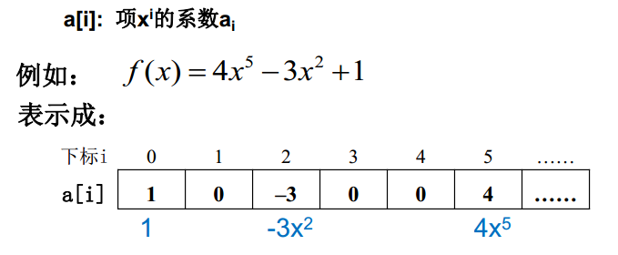

#### 2.1 线性表及其实现

例子：多项式表示

关键数据：1、多项式项数n；2、各项系数$a_i$以及指数i

##### 方法一：顺序存储结构直接表示



问题：如何表示$x+3x^{2000}$


##### 方法二：每个非零项$a_ix^i$涉及两个信息：系数$a_i$ 和指数i，可以将一个多项式看成是一个$(a_i, i)$二元组的集合。


相加过程：


##### 方法3：链表结构存储非零项

链表中每个结点存储多项式中的一个非零项，包括系数和指数两个数据域以及一个指针域。

```c
typedef struct PolyNode *Polynomial;
struct PolyNode{
	int coef;
	int expon;
	Polynomial link;
}
```

例如：

$P_1(x) = 9x^{12} + 15x^8 + 3x^2$ 和$P_2(x) = 26x^{19} - 4x^8 - 13x^6 + 82$


**启发**：

1. 同一个问题可以有不同的表示（存储）方法

2. 有一类共性问题：有序线性序列的组织和管理 


##### **线性表(Linear List)**：由同类型数据元素构成有序序列的线性结构

- 表中元素个数称为线性表的长度
- 线性表没有元素时，称为空表
- 表起始位置称表头，表结束位置称表尾 


##### 线性表的抽象数据类型描述

类型名称： 线性表（List）

数据对象集： 线性表是 n (≥0)个元素构成的有序序列( a1, a2, ,an )

操作集： 线性表L  List，整数i表示位置，元素X  ElementType，

线性表基本操作主要有：

1. List MakeEmpty()： 初始化一个空线性表L；
2. ElementType FindKth( int K, List L )：根据位序K，返回相应元素 ；
3. int Find( ElementType X, List L )：在线性表L中查找X的第一次出现位置；
4. void Insert( ElementType X, int i, List L)：在位序i前插入一个新元素X；
5.  void Delete( int i, List L )：删除指定位序i的元素；
6. int Length( List L )：返回线性表L的长度n。 